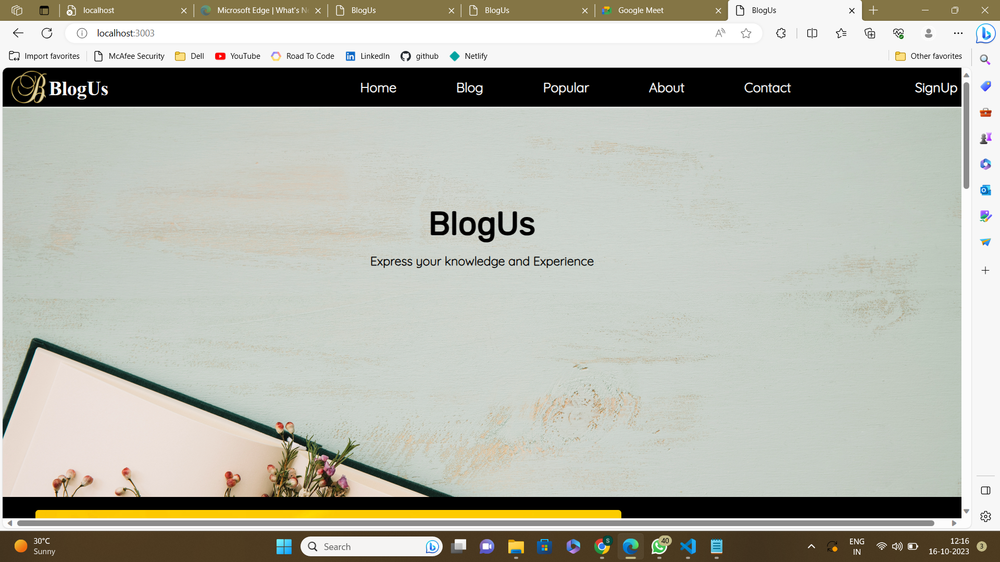
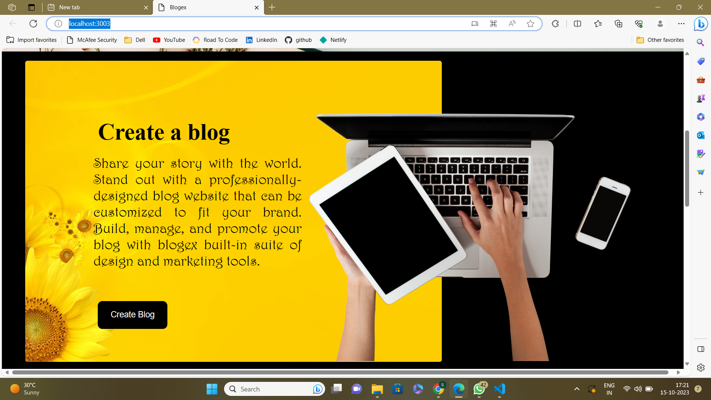
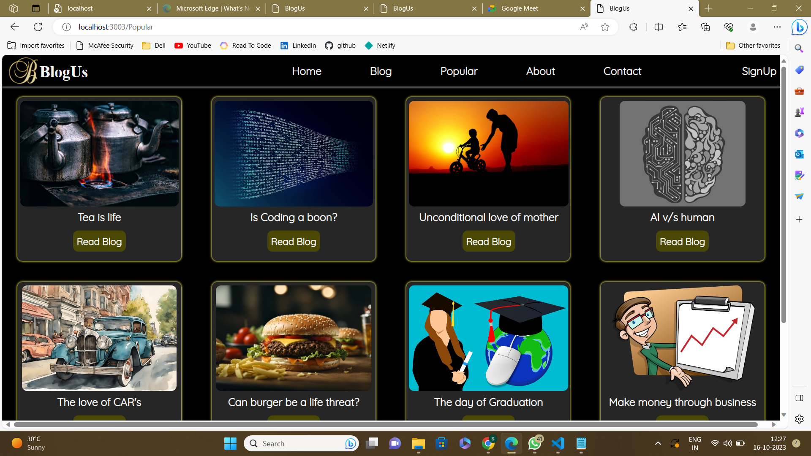
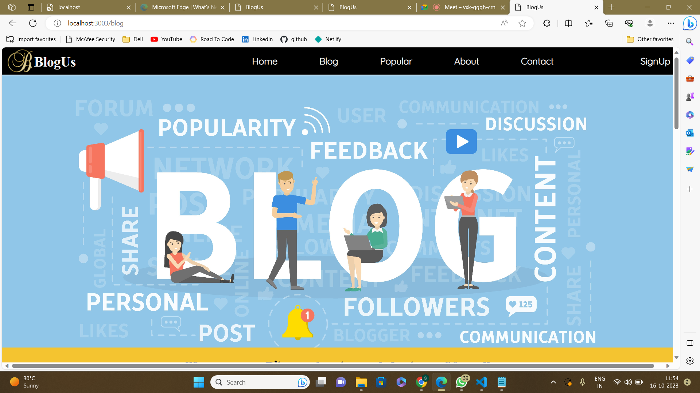
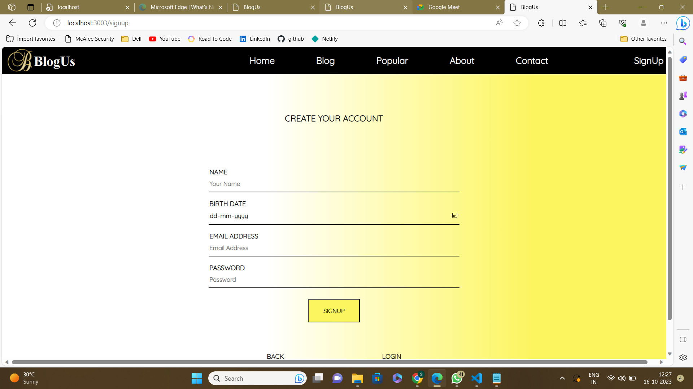

# BlogUs
### BlogUs is a blog website which contains many blog post within itself. BlogUs website is a site that is updated with new information on an ongoing basis and normally consists of a collection of posts.One of the greatest benefits of blogging is that it helps you connect and build relationships with leads and customers.If you are starting from scratch,the blogging platform 'BlogUs' allow you to get started for free.

## <u>Home page</u>

   

## <u>Popular Blogs page

## <u>Blogwriting page

## <u>About page

## <u>Signup page

## Contributors

